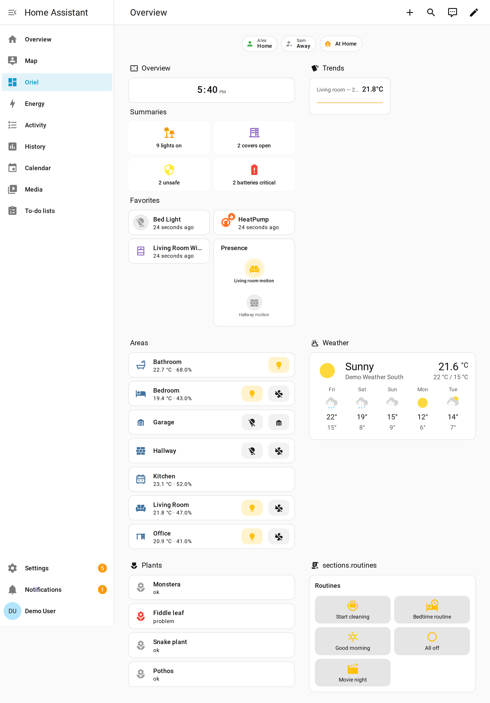
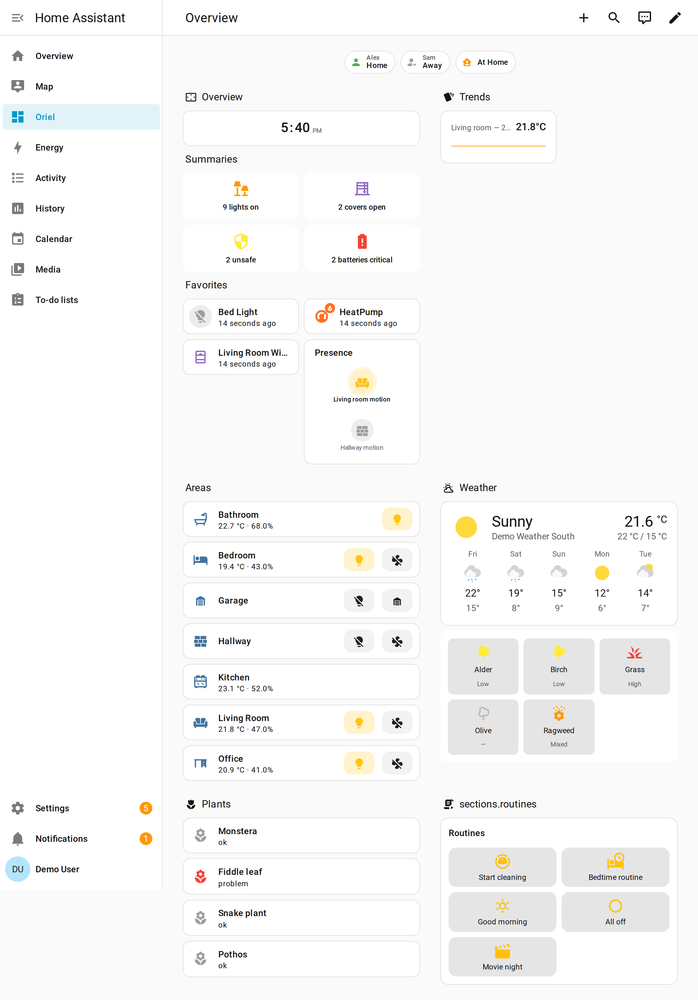
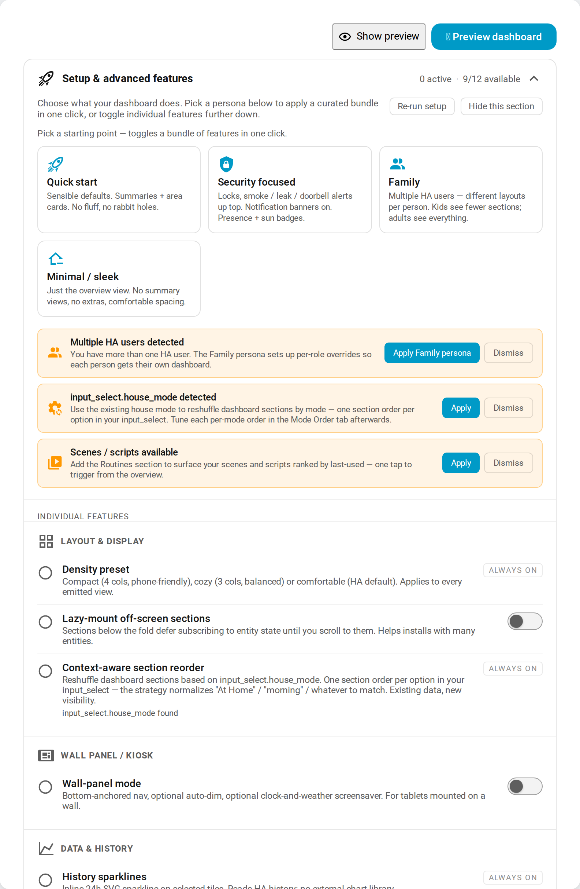

# Oriel Dashboard

**Englisch** · [Deutsch](README.de.md) *(kommt bald – Beiträge willkommen, siehe [TRANSLATING.md](TRANSLATING.md))*

Eine Lovelace-Strategie für Home Assistant. Sie generiert dein Dashboard aus deinen Bereichen, Geräten und Entitäten und ermöglicht es dir, jede Komponente über einen visuellen Editor anzupassen, statt YAML zu bearbeiten.

Aufgebaut auf der Grundlage der [simon42-dashboard-strategy](https://github.com/TheRealSimon42/simon42-dashboard-strategy) (automatisch generierte Raumansichten, Übersichts-Kacheln, Bereichs-Grid). Simon42 bleibt die fokussierte, und einfache Option; Oriel ist für Nutzer, die sich mehr Stellschrauben und individuelle Anpassungen wünschen. Der Wechsel erfolgt über eine einmalige YAML-Anpassung – siehe [MIGRATION.md](MIGRATION.md).


*Oriels automatisch generierte Übersicht, gerendert mit Demo-Daten.*

---

## Installation

Über HACS (Custom Repository):

1. HACS → Frontend → ⋮ → Custom repositories  
2. `https://github.com/TheDave94/oriel-dashboard` hinzufügen, Kategorie **Dashboard**  
3. **Oriel Dashboard** installieren  
4. Home Assistant neu laden, sobald HACS dich dazu auffordert  

Minimale Home-Assistant-Version: **2025.5**.

## Schnellstart

Erstelle ein neues Dashboard (**Einstellungen → Dashboards → Dashboard hinzufügen → Neues Dashboard von Grund auf**) und öffne dessen Rohkonfiguration (⋮ → Rohkonfiguration bearbeiten) und ersetze den Inhalt mit:

```yaml
strategy:
  type: custom:oriel
```
Lade das Dashboard neu. Oriel generiert eine Übersichtsansicht sowie je eine Ansicht pro Bereich mit sinnvollen Standardwerten.

Alles Weitere erreichst du über den Strategie-Editor (Dashboard bearbeiten → ⚙ Strategieoptionen). Der Editor ist die maßgebliche Methode zur Konfiguration von Oriel. Die YAML-Konfiguration ist eine Darstellung, nicht die Referenz – fortgeschrittene Benutzer können sie zwar manuell bearbeiten, aber der Editor zeigt alle Funktionen ohne manuelle Anpassung.

---

## Was enthalten ist

Elf benutzerdefinierte Karten und zwei Kachel-Funktionen. Oriel gibt sie automatisch aus, wo sie passen; du kannst sie auch manuell in `custom_cards` oder `favorites` platzieren.

**Karten**

- `oriel-summary-card` — Zählungen und Schnellsteuerungen für Lichter, Rollläden, Sicherheitssysteme, Batterien und Klima
- `oriel-lights-group-card` — Ein-/Aus-Gruppe für Lichter mit optionaler Etagen-Gruppierung
- `oriel-covers-group-card` — Gruppe für offene/geschlossene Rollläden
- `oriel-zone-presence-card` — Übersicht, wer sich in welcher Zone befindet
- `oriel-sparkline-card` — 24-Stunden-Trend inline, optional unterstützt durch ApexCharts
- `oriel-routines-card` — Szenen und Skripte nach zuletzt verwendeter Reihenfolge sortiert
- `oriel-notification-card` — Ständige Banner für Rauch-, Leckage-, Türklingel- und andere Alarme
- `oriel-screensaver-card` — Leerlaufbildschirm für Wandpanel
- `oriel-voice-fab` — Schwebender Sprachassistent-Button (Assist)
- `oriel-pollen-card` — Pollenbelastung, **automatisch erkannt** über die [PollenWatch](https://github.com/TheDave94/pollenwatch)-Integration (als native Karte dargestellt, keine manuelle Konfiguration erforderlich)
- `oriel-air-quality-card` — Luftqualität aus mehreren Quellen, **automatisch erkannt** über die [AirWatch](https://github.com/TheDave94/airwatch)-Integration: schlechtester Teilindex, Konsens pro Schadstoff, N-von-M-Quellen-Badge und explizite Abweichung (als native Karte dargestellt, keine manuelle Konfiguration erforderlich)

**Kachel-Funktionen**

- `oriel-sticky-lock-feature` — Raummodus fixieren
- `oriel-cost-overlay-feature` — €/h-Anzeige pro Tile basierend auf Leistung × Tarif

### Optionale Komponenten

Oriel generiert ein vollständiges Dashboard mit **null optionalen Abhängigkeiten**. Installiere eine der sechs optionalen Komponenten und es aktiviert die passende Oberfläche — keine manuelle Kartenkonfiguration — und jede hat einen eingebauten Fallback, sodass nie etwas kaputtgeht.

| Ohne optionale Komponenten | Mit installierten Komponenten |
|---|---|
|  |  |

Gleiches Zuhause, gleiche Konfiguration. Die **rechte** Stufe fügt PollenWatch's Pollen-Prognose-Kacheln unter Wetter hinzu — die eine optionale Komponente, die einen *neuen* statischen Abschnitt beiträgt. Die anderen fünf verbessern Interaktion oder Datendichte, anstatt eine Karte hinzuzufügen (siehe Tabelle). Beide Stufen rendern Oriels eingebaute SVG-Sparkline in *Trends*; mit installiertem ApexCharts wird das zu einem reichhaltigeren Diagramm in einem Live-Browser.

| Optionale Komponente | Typ | Wie Oriel sie erkennt | Was sie aktiviert | Fallback wenn fehlend |
|---|---|---|---|---|
| **PollenWatch** | HA-Integration | irgendeine `sensor.pollenwatch_*`-Entität | First-Party Pollen-Prognose-Kacheln (`oriel-pollen-card`) unter Wetter | Pollen-Abschnitt ausgelassen |
| **Bubble Card** | HACS-Plugin | `bubble-card`-Element registriert | Pop-up-Kachel-Navigation / interaktive Kacheln | Standard More-Info-Dialoge |
| **ApexCharts** (`apexcharts-card`) | HACS-Plugin | `apexcharts-card`-Element + per-Karte `use_apexcharts` | Reichhaltigere historische Trenddiagramme in der Sparkline | Eingebaute SVG-Sparkline |
| **Floorplan** (`floorplan-card`) | HACS-Plugin | `floorplan-card`-Element registriert | Dedizierte interaktive Grundriss-Ansicht | Ansicht ausgelassen; Standard-Bereichskarten |
| **decluttering-card** | HACS-Plugin | `decluttering_templates` in der Konfiguration definiert | Wiederverwendbare Karten-Templates auf Lovelace-Root-Ebene | Templates ignoriert; Inline-Karten |
| **search-card** | HACS-Plugin | `search-card`-Element (+ `card-tools`), `show_search_card` | Entitäten-Suchkarte | Keine Suchkarte; Editor markiert sie als fehlend |

Keine ist erforderlich; jede hat einen sauberen Fallback, der ohne sie funktioniert — weniger poliert, nie kaputt.

---

## Konfiguration

Der Editor zeigt alles. Die Hinweise unten beschreiben die Hauptaspekte, die du bearbeiten wirst; der Editor zeigt sie mit Beschreibungen und HACS-Installationshinweisen an.

[](docs/images/editor.png)

**Abschnitt-Umschalter.** Schalte jeden Übersichtsabschnitt ein oder aus — Uhr, Suche, Wetter, Energie, Zusammenfassungen, Favoriten, Bereiche. Die Zusammenfassungen selbst sind auch einzeln umschaltbar (Lichter, Rollläden, Sicherheit, Batterien, Klima).

**Layout.** Wähle eine Dichteeinstellung (`compact` / `cozy` / `comfortable`) und eine Anzahl von Spalten für die Zusammenfassungszeile (`summaries_columns: 2 | 4`). Gruppiere Lichter und Rollläden nach Stockwerk, wenn dein Zuhause mehr als eines hat.

**Pro-Bereich-Kontrolle.** Verberge ganze Bereiche, ordne sie neu, oder überschreibe, was in einem bestimmten Raum angezeigt wird, ohne den Rest zu ändern. Entitäts-Level-Verbergung ist auch pro (Bereich, Domäne)-Paar verfügbar.

**Sichtbarkeitsregeln.** Zeige oder verberge Abschnitte basierend auf Benutzerrolle, Tageszeit, deiner `house_mode`-Entität, Viewport-Klasse (Telefon / Tablet / Wand), oder zusammensetzbaren `any[]`/`all[]`-Prädikaten.

**Pro-Benutzer-Dashboards.** Unterschiedliche Layouts pro Home Assistant-Benutzer oder -Label.

**HACS-Plugin-Verbesserungen.** Oriel erkennt optionale Komponenten automatisch — PollenWatch, Bubble Card, ApexCharts, decluttering-card, floorplan-card und search-card — und aktiviert reichhaltigere Varianten, jede mit einem sauberen Fallback, der ohne sie funktioniert. Sieh die vollständige Tabelle unter [Optionale Komponenten](#optionale-komponenten).

**Plugin-Erweiterungs-API.** Drittanbieter-Plugins können Abschnitte und Badges via `window.oriel.registerSection(...)` registrieren.

**Theming.** Die Karten exponieren `--oriel-*` CSS-Custom-Properties — die vollständige Token-Liste steht in [MIGRATION.md](MIGRATION.md#surface-that-changed--power-user-reference).

**Manuelles Erstellen von benutzerdefinierten Karten (YAML-direct).** Wenn du einen `custom_cards`-Eintrag (oder `custom_views` / `custom_badges` / `custom_sections`) von Hand hinzufügst, gib ihm die Kartenkonfiguration unter einem `card:`-Schlüssel (oder äquivalentem `config:`):

```yaml
custom_cards:
  - target_section: custom_cards
    card:
      type: markdown
      content: Hello
```

Oriel normalisiert `card:`/`config:` zu seinem internen `parsed_config` beim Rendern. Ein `yaml:`-*String* ist ein Editor-nur-Input (er wird vom GUI geparst, nicht beim Rendern). Der GUI-Editor kanonisiert alles zu `parsed_config` beim Speichern, also sind `card:`/`config:` rein eine Annehmlichkeit für das authoring von Roh-YAML. Für die vollständige Editor-Einführung, öffne den Editor — jedes Feld hat eine Inline-Beschreibung.

---
## Fehlerbehebung

### „Custom element existiert nicht: custom:oriel-something-card“

Wahrscheinlich gibt es noch einen alten Verweis in deinem YAML.

Wenn du von simon42 kommst und dein Dashboard-YAML manuell bearbeitet hast, suche in der Rohkonfiguration nach `simon42-` und ersetze jeden Treffer durch `oriel-`. Siehe [MIGRATION.md](MIGRATION.md) für die vollständige Zuordnungstabelle.

Wenn du Oriel manuell installiert hast, bevor HACS unterstützt wurde (vor 2025), können sowohl die alten Dateien in `www/` als auch die alte Resource-URL weiterhin geladen werden. Entferne sie, führe einen Hard-Refresh im Browser aus und lade Home Assistant neu.

### Das Dashboard ändert sich nicht, nachdem ich die Konfiguration bearbeitet habe

Führe einen Hard-Refresh im Browser aus (Cmd+Shift+R auf macOS, Ctrl+Shift+R unter Windows / Linux). Home Assistant cached die Dashboard-Konfiguration sehr aggressiv.

Öffne die Browser-Konsole (F12). Bei einem frischen Laden gibt Oriel `Oriel Dashboard vX.Y.Z loaded` aus — prüfe, ob die Version mit der neuesten Release-Version übereinstimmt.

### Etwas anderes

Eröffne ein Issue — die [Bug-Report-Vorlage](.github/ISSUE_TEMPLATE/bug_report.md) führt dich durch die relevanten Felder für Version und Konsolenausgabe. Fehlermeldungen auf Deutsch sind möglich, Englisch ist nicht zwingend erforderlich.


---

## Origin

Geforkt von [@TheRealSimon42](https://github.com/TheRealSimon42)'s Dashboard-Strategie — Anerkennung dort für das Auto-Generierungs-Muster. Oriel nimmt diesen Kern in eine andere Richtung: maximale Konfigurierbarkeit und Integrationsfläche, alles erreichbar durch den Editor. Simon42 bleibt die fokussierte, meinungsstarke Option; Oriel ist für Nutzer, die das Konfigurierbare wollen. Sieh [MIGRATION.md](MIGRATION.md) zum Wechseln.

Erstellt von [@TheDave94](https://github.com/TheDave94).

---

## Further reading

- [MIGRATION.md](MIGRATION.md) — Wechsel von simon42 zu Oriel (Englisch)
- [CHANGELOG.md](CHANGELOG.md) — Was sich in jeder Version geändert hat (Englisch)
- [GitHub Releases](https://github.com/TheDave94/oriel-dashboard/releases) — Vollständige Release-Notizen mit Assets (Englisch)
- [TRANSLATING.md](TRANSLATING.md) — Wie du beim Übersetzen helfen kannst (Englisch)

---

## Related projects

Oriel works on its own, and is also deliberately built to work alongside two
multi-source Home Assistant integrations:

- **[PollenWatch](https://github.com/TheDave94/pollenwatch)** — a pollen
  integration that Oriel **auto-detects** and renders as a first-party pollen
  card + badges, with no manual card configuration.
- **[AirWatch](https://github.com/TheDave94/airwatch)** — a multi-source
  air-quality integration sharing PollenWatch's architecture. Oriel
  **auto-detects** it and renders a first-party air-quality card — worst
  sub-index, per-pollutant consensus, an N-of-M source badge, and explicit
  divergence — with no manual card configuration.

## License

[MIT](LICENSE) © Oriel Dashboard contributors.