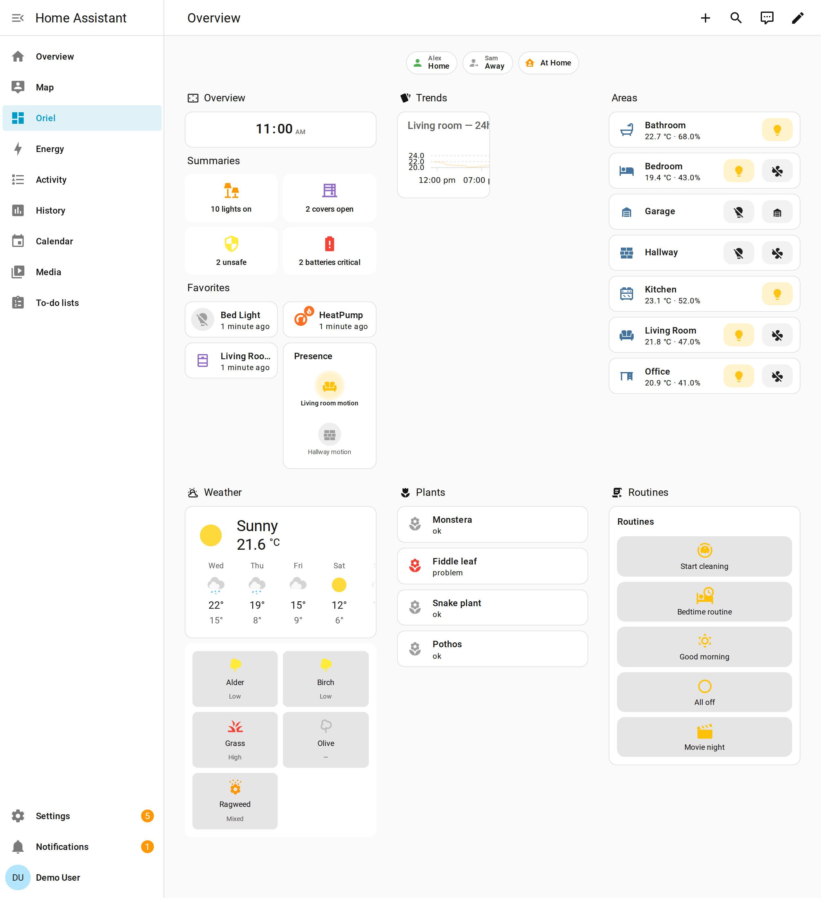

# Oriel Dashboard

**English** · [Deutsch](README.de.md) *(coming soon — contributions welcome, see [TRANSLATING.md](TRANSLATING.md))*

A Lovelace strategy for Home Assistant. It generates your dashboard from your areas, devices, and entities, and lets you customise every part through a visual editor instead of editing YAML.

Built on the foundation [simon42-dashboard-strategy](https://github.com/TheRealSimon42/simon42-dashboard-strategy) established (auto-generated room views, summary tiles, area grid). Simon42 remains the focused, opinionated option; Oriel is for users who want more handles to pull. Switching is a one-shot YAML edit — see [MIGRATION.md](MIGRATION.md).



*Oriel's auto-generated Overview, rendered against demo data.*

---

## Install

Via HACS (custom repository):

1. HACS → Frontend → ⋮ → Custom repositories
2. Add `https://github.com/TheDave94/oriel-dashboard`, category **Lovelace**
3. Install **Oriel Dashboard**
4. Reload Home Assistant when HACS prompts you

Minimum Home Assistant version: **2025.5**.

> **Sprichst du Deutsch?** Du kannst Issues gerne auf Deutsch eröffnen — die Vorlage ist auf Deutsch und der Maintainer ist deutschsprachig.

---

## Quick start

Create a new dashboard (Settings → Dashboards → Add dashboard → New dashboard from scratch), then open its raw configuration (⋮ → Edit raw configuration) and replace the contents with:

```yaml
strategy:
  type: custom:oriel
```

Reload the dashboard. Oriel generates an Overview view plus one view per area, with sensible defaults.

Everything else is reached through the **strategy editor** (Edit dashboard → ⚙ Strategy options). The editor is the canonical way to configure Oriel. The YAML config is a representation, not the source of truth — power users can still hand-edit, but the editor exposes every feature without requiring it.

---

## What ships

Ten custom cards and two tile features. Oriel emits them automatically where they fit; you can also place them by hand inside `custom_cards` or `favorites`.

**Cards**

- `oriel-summary-card` — counts and quick controls for lights, covers, security, batteries, climate
- `oriel-lights-group-card` — on/off light grouping with optional floor grouping
- `oriel-covers-group-card` — open/closed cover grouping
- `oriel-zone-presence-card` — who is in which zone, at a glance
- `oriel-sparkline-card` — inline 24-hour trend, optionally backed by ApexCharts
- `oriel-routines-card` — scenes and scripts ranked by last-used
- `oriel-notification-card` — sticky banner for smoke, leak, doorbell, and other alerts
- `oriel-screensaver-card` — wall-panel idle screen
- `oriel-voice-fab-card` — floating Assist voice button
- `oriel-pollen-card` — pollen levels from the [PollenWatch](https://github.com/TheDave94/pollenwatch) integration

**Tile features**

- `oriel-sticky-lock-feature` — keep a room mode pinned
- `oriel-cost-overlay-feature` — per-tile €/h reading from power × tariff

---

## Configuration

The editor exposes everything. The notes below describe the main axes you will touch; the editor surfaces them with descriptions and HACS-install hints where relevant.

**Section toggles.** Turn each overview section on or off — clock, search, weather, energy, summaries, favorites, areas. The summaries themselves are also individually toggleable (lights, covers, security, batteries, climate).

**Layout.** Choose a density preset (`compact` / `cozy` / `comfortable`) and a number of columns for the summary row (`summaries_columns: 2 | 4`). Group lights and covers by floor when your home has more than one.

**Per-area control.** Hide entire areas, reorder them, or override what shows inside one specific room without touching the rest. Entity-level hiding is also available per (area, domain) pair.

**Visibility rules.** Show or hide sections based on user role, time of day, your `house_mode` entity, viewport class (phone / tablet / wall), or composable `any[]`/`all[]` predicates.

**Per-user dashboards.** Different layouts per Home Assistant user or label.

**HACS plugin enhancements.** When Bubble Card, ApexCharts, decluttering-card, or floorplan-card are installed, Oriel auto-detects them and offers richer card variants. Every feature also has a clean fallback that works without any HACS plugin — less polished, never broken.

**Plugin extension API.** Third-party plugins can register sections and badges via `window.oriel.registerSection(...)`.

**Theming.** The cards expose `--oriel-*` CSS custom properties — the full token list is in [MIGRATION.md](MIGRATION.md#surface-that-changed--power-user-reference).

**Hand-authoring custom cards (YAML-direct).** When you add a `custom_cards` (or `custom_views` / `custom_badges` / `custom_sections`) entry by hand, give it the card config under a `card:` (or equivalent `config:`) key:

```yaml
custom_cards:
  - target_section: custom_cards
    card:
      type: markdown
      content: Hello
```

Oriel normalizes `card:`/`config:` to its internal `parsed_config` at render. A `yaml:` *string* is an editor-only input (it is parsed by the GUI, not at render). The GUI editor canonicalizes everything to `parsed_config` on save, so `card:`/`config:` are purely a convenience for authoring raw YAML.

For the full editor walkthrough, open the editor — every field has an inline description.

---

## Troubleshooting

### "Custom element doesn't exist: custom:oriel-something-card"

You probably have an old reference in your YAML.

If you came from simon42 and edited your dashboard YAML by hand, search the raw configuration for `simon42-` and replace each match with `oriel-`. See [MIGRATION.md](MIGRATION.md) for the full swap table.

If you installed Oriel manually before HACS support (before 2025), the old files in `www/` and the old resource URL can both still be loaded. Remove them, hard-refresh the browser, and reload Home Assistant.

### The dashboard doesn't change after I edit the config

Hard-refresh the browser (Cmd+Shift+R on macOS, Ctrl+Shift+R on Windows / Linux). Home Assistant caches the dashboard config aggressively.

Open the browser console (F12). On a fresh load, Oriel prints `Oriel Dashboard vX.Y.Z loaded` — check the version matches the latest release.

### Something else

Open an issue — the [bug report template](.github/ISSUE_TEMPLATE/bug_report.md) walks you through the relevant version and console-output fields. German issues are welcome.

---

## Origin

Forked from [@TheRealSimon42](https://github.com/TheRealSimon42)'s dashboard strategy — credit there for the auto-generation pattern. Oriel takes that core in a different direction: maximum configurability and integration surface, all reachable through the editor. Simon42 stays the focused, opinionated option; Oriel is for users who want the configurable one. See [MIGRATION.md](MIGRATION.md) to switch.

Built by [@TheDave94](https://github.com/TheDave94).

---

## Further reading

- [MIGRATION.md](MIGRATION.md) — moving from simon42 to Oriel
- [CHANGELOG.md](CHANGELOG.md) — what changed in each version
- [GitHub Releases](https://github.com/TheDave94/oriel-dashboard/releases) — full release notes with assets
- [TRANSLATING.md](TRANSLATING.md) — how to translate this README
